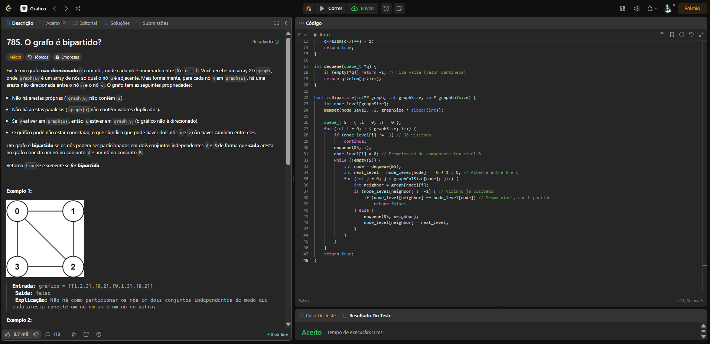
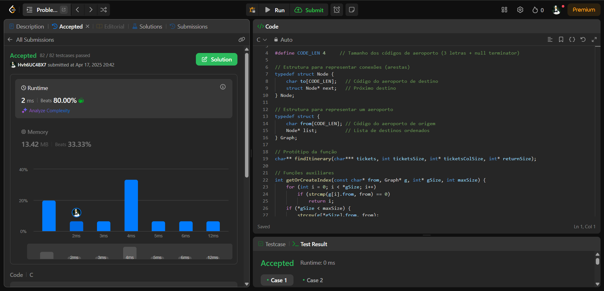
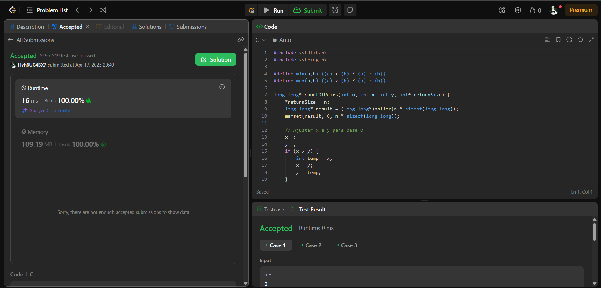
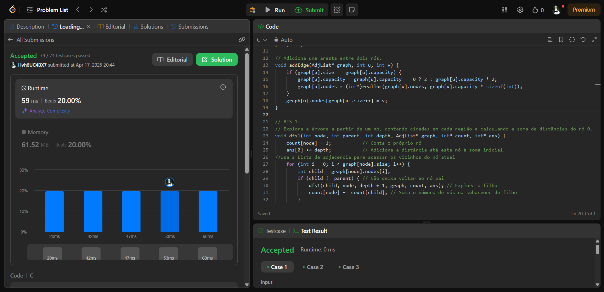

**Grafos1_Leetcode** 

# Leetcode

**Número da Lista**: 1<br>
**Conteúdo da Disciplina**: Grafos 1 <br>

## Alunos
|Matrícula | Aluno |
| -- | -- |
| 21/1061897  |  Igor de Sousa Justino |
| 21/1061968  |  João Pedro Veras Gomes |

## Sobre 
O projeto consiste na resolução de questões que examinam o conteúdo visto na sala de aula sobre conceitos iniciais de gráficos

## Problema 1: [785 Is Graph Bipartite?](https://leetcode.com/problems/is-graph-bipartite/solutions/?envType=problem-list-v2&envId=graph)
- Nível: Médio
- Implementação:[Código 1](https://github.com/projeto-de-algoritmos-2025/Grafos-1/blob/main/is%20Graph%20Bipartite%3F%20785)

**_A atividade tem como objetivo verificar se um grafo não direcionado pode ser dividido em dois grupos de vértices, de forma que não existam arestas entre vértices do mesmo grupo. O grafo é representado por uma lista de adjacência. A tarefa é retornar true se ele for bipartido e false caso contrário. A solução envolve percorrer o grafo (usando BFS ou DFS) e tentar colorir os vértices com duas cores diferentes. Se houver um conflito de coloração, o grafo não é bipartido. O problema é útil em contextos como formação de grupos e detecção de ciclos ímpares._**
  

## Problema 2: [332 Reconstruct Itinerary](https://leetcode.com/problems/reconstruct-itinerary/description/)
- Nível: Difícil
- Implementação:[Código 2](https://github.com/projeto-de-algoritmos-2025/Grafos-1/blob/main/332.%20Reconstruct%20Itinerary)

**_O problema consiste em reconstruir um itinerário de viagem a partir de uma lista de passagens aéreas. Cada passagem é representada por um par de cidades (origem, destino), e a tarefa é encontrar uma sequência válida de voos que comece em uma cidade específica (geralmente "JFK") e utilize todas as passagens exatamente uma vez. A solução deve retornar o itinerário em ordem lexicográfica, caso existam múltiplas possibilidades. O problema testa habilidades em grafos, busca em profundidade (DFS) e ordenação, exigindo uma abordagem eficiente para lidar com ciclos e conexões._**



## Problema 3: [3017 Count the Number of Houses at a Certain Distance II](https://leetcode.com/problems/count-the-number-of-houses-at-a-certain-distance-ii/description/)
- Nível: Difícil
- Implementação:[Código 3](https://github.com/projeto-de-algoritmos-2025/Grafos-1/blob/main/3017.%20Count%20the%20Number%20of%20Houses%20at%20a%20Certain%20Distance%20II)
  
**_O problema  consiste em calcular quantos pares de casas em uma rua reta (representada por uma linha numérica) estão a uma certa distância, considerando um ponto fixo que divide a rua. Dadas as posições das casas e do ponto, a tarefa é determinar o número de pares para cada distância possível. A solução exige eficiência na manipulação de arrays e cálculos de distâncias, ajustando para o ponto fixo._**



## Problema 4: [834 Sum of Distances in Tree](https://leetcode.com/problems/sum-of-distances-in-tree/description/)
- Nível: Difícil
- Implementação:[Código 4](https://github.com/projeto-de-algoritmos-2025/Grafos-1/blob/main/834.png)

**_O problema envolve calcular a soma das distâncias de cada nó a todos os outros nós em uma árvore não direcionada. Dada a quantidade de nós e as arestas que os conectam, a tarefa é retornar um array onde cada elemento representa a soma das distâncias de um nó específico a todos os outros._**



## Instalação 
**Linguagem**: C <br>
**Framework**: _(Nenhum)_ <br>

## Uso
Necessário um compilador C99 ou superior. Por exemplo, para compilar o arquivo `problem1.c` utilizando o GCC:

```
$ gcc ./problem.1c -o problem1
$ ./problem1
```


