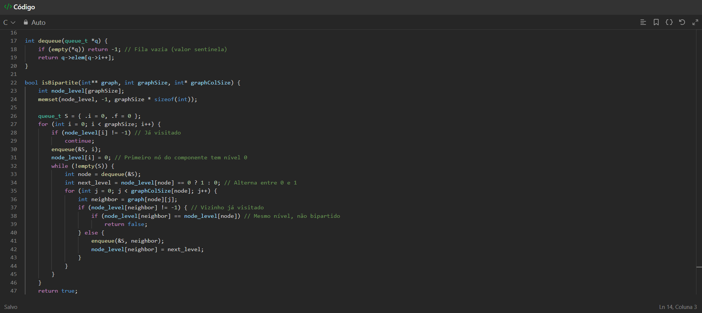

**Grafos1_Leetcode** 

# Leetcode

**Número da Lista**: 1<br>
**Conteúdo da Disciplina**: Grafos 1 <br>

## Alunos
|Matrícula | Aluno |
| -- | -- |
| 21/1061897  |  Igor de Sousa Justino |
| 21/1061968  |  João Pedro Veras Gomes |

## Sobre 
O projeto consiste na resolução de questões que examinam o conteúdo visto na sala de aula sobre conceitos iniciais de gráficos


785 Is Graph Bipartite? 

## Problema 1: [785 Is Graph Bipartite?](https://leetcode.com/problems/is-graph-bipartite/solutions/?envType=problem-list-v2&envId=graph)




## Instalação 
**Linguagem**: C <br>
**Framework**: _(Nenhum)_ <br>

## Uso
Necessário um compilador C99 ou superior. Por exemplo, para compilar o arquivo `problem1.c` utilizando o GCC:

```
$ gcc ./problem.1c -o problem1
$ ./problem1
```


